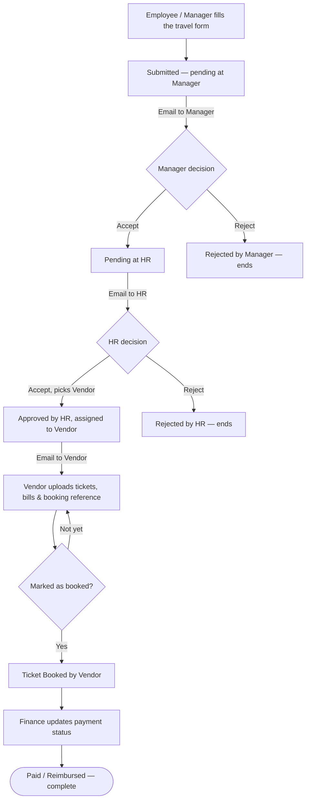
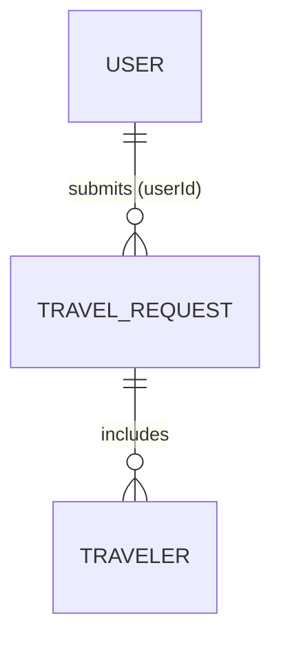
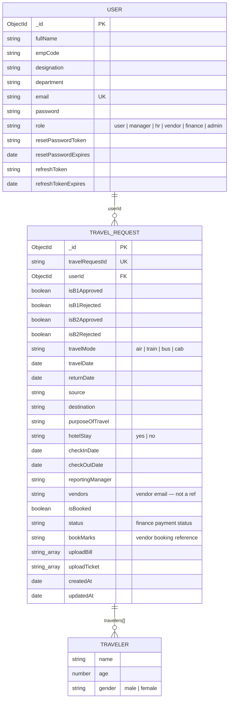

# Travel Desk Management System

A role-based platform for managing corporate travel requests end to end — from
submission, through manager and HR approval, to vendor booking and finance
payment tracking.

## Contents

- [Dashboard preview](#dashboard-preview)
- [Features](#features)
- [Roles](#roles)
- [How a request flows](#how-a-request-flows)
- [Flow diagram](#flow-diagram)
- [ER diagram](#er-diagram)
- [Schema diagram](#schema-diagram)
- [Tech stack](#tech-stack)
- [Project structure](#project-structure)
- [Getting started](#getting-started)
- [Available scripts](#available-scripts)
- [Known limitations](#known-limitations)

## Dashboard preview

| Employee | Manager / HR | Vendor | Finance | Admin |
|----------|--------------|--------|---------|-------|
| _screenshot coming soon_ | _screenshot coming soon_ | _screenshot coming soon_ | _screenshot coming soon_ | _screenshot coming soon_ |

<!--
Once screenshots are captured, drop them in `docs/screenshots/` and swap
each cell above for:

-->

## Features

- **Employee Requests** — submit a travel request (with multiple travelers on
  one trip if needed) and track its live status from a personal "Applied
  Form" list: pending with manager, pending with HR, rejected, approved, or
  booked.
- **Two-Step Approval** — every request goes to the reporting manager first,
  then to HR. Each step sends an automatic email to the next approver
  (manager → HR → vendor). A reject at either step ends the request there.
- **Vendor Booking** — once HR approves and assigns a vendor, the vendor sees
  the request, uploads the ticket and bill, records a booking reference, and
  marks the ticket as booked once travel is confirmed.
- **Finance Tracking** — finance sees every HR-approved request and updates
  its payment status (pending, paid, or reimbursed).
- **Admin Overview** — a read-only view (in the UI) of every pending and
  approved request across the company, for full management visibility.
- **Search, Filter & Export** — search and page through long lists of
  requests, and export pending requests to Excel with one click.
- **User Management** — HR can create, update, and remove accounts for
  employees, managers, vendors, and finance staff.
- **Secure Login & Password Reset** — JWT session in an httpOnly cookie,
  bcrypt-hashed passwords, and an email-based forgot/reset-password flow.
  New accounts can be created either by signing up directly or by HR adding
  a user from the dashboard.

## Roles

| Role     | Can do |
|----------|--------|
| Employee | Submit and track their own requests |
| Manager  | First approval on a request |
| HR       | Second approval, assigns a vendor, manages user accounts |
| Vendor   | Uploads tickets/bills, records a booking reference, marks a request as booked |
| Finance  | Updates payment status |
| Admin    | Views every request across the company (read-only in the UI) |

## How a request flows

1. **Start** — an employee or manager opens the system and fills out the travel request form.
2. **Request submitted** — status becomes *pending approval at reporting manager*; the manager is emailed automatically.
3. **Manager decision:**
   - Accept → status becomes *pending approval at HR*; HR is emailed.
   - Reject → status becomes *rejected by manager*; the flow ends here.
4. **HR decision:**
   - Accept → HR assigns a vendor from a dropdown; status becomes *approved by HR, assigned to vendor*; the vendor is emailed.
   - Reject → status becomes *rejected by HR*; the flow ends here.
5. **Vendor receives the request** — sees it in their dashboard after the email notification.
6. **Vendor uploads documents** — tickets, bills, and a booking reference.
7. **Vendor updates booking status** — keeps uploading until travel is confirmed, then marks the request as *booked*; it moves to the Booked Tickets view.
8. **Finance updates payment** — sets the payment status to *paid* or *reimbursed*.
9. **End** — the travel request lifecycle is complete.

Admin can view the request at any point in this flow, across every employee and vendor, without needing to be part of the approval chain.

## Flow diagram



## ER diagram



`vendors` on a travel request is stored as a plain email string (set by HR),
not a database reference — so it's shown in the schema diagram below rather
than as a relationship here.

## Schema diagram



## Tech stack

**Client** — React 19, Vite, Tailwind CSS, MUI, Redux Toolkit, React Router,
Axios, react-icons, xlsx (Excel export).

**Server** — Node.js, Express, MongoDB (Mongoose), JWT auth (httpOnly
cookies), bcrypt, Multer (file uploads), Nodemailer (email notifications).

## Project structure

```
travel-desk-management-system/
├── client/            React frontend (Vite)
│   └── src/
│       ├── pages/     Route-level pages (dashboards, forms, landing page)
│       └── components/
└── server/            Express backend
    └── src/
        ├── models/       Mongoose schemas (User, TravelRequest)
        ├── controllers/  Route handlers
        ├── services/     Business logic
        ├── routes/       API route definitions
        ├── middleware/   Auth & role guards, file upload
        └── utils/        Email templates & helpers
```

## Getting started

### Prerequisites

- Node.js
- A MongoDB instance (local or Atlas)
- An SMTP account for outgoing email (e.g. Mailtrap for development)

### Server setup

```bash
cd server
npm install
```

Create a `.env` file in `server/` with:

```
PORT=5000
VITE_FRONTEND_KEY=http://localhost:5173

MONGODB_URI=your_mongodb_connection_string

JWT_SECRET=your_jwt_secret
JWT_REFRESH_SECRET=your_refresh_secret

EMAIL_HOST=your_smtp_host
EMAIL_PORT=587
EMAIL_USER=your_smtp_user
EMAIL_PASS=your_smtp_password
```

```bash
npm run dev
```

### Client setup

```bash
cd client
npm install
```

Create a `.env` file in `client/` with:

```
VITE_API_KEY=http://localhost:5000
```

```bash
npm run dev
```

The client runs on `http://localhost:5173` and talks to the server on
`http://localhost:5000`.

### Creating your first account

There's no seed data — go to `/signup`, fill in your details, and pick a
role (Employee, Manager, HR, Vendor, or Finance). Pick **HR** first if you
want to add the rest of your team afterward from the HR dashboard, since
that's the only role with a "Create User" screen. (The `admin` role isn't
offered on the sign-up form; it has to be set directly on the user document
in the database.)

## Available scripts

**Server** (run from `server/`)

| Command | Description |
|---------|-------------|
| `npm start` | Run the server once with plain Node |
| `npm run dev` | Run the server with nodemon (auto-restarts on changes) |

**Client** (run from `client/`)

| Command | Description |
|---------|-------------|
| `npm run dev` | Start the Vite dev server |
| `npm run build` | Build a production bundle |
| `npm run preview` | Preview the production build locally |
| `npm run lint` | Run ESLint |

## Known limitations

- `POST /register` and the `/signup` page are open to anyone and let the
  caller pick their own role — there's no invite-only gate yet.
- `GET /managers` and `GET /vendors` are unauthenticated.
- File uploads (tickets/bills) have no size or file-type restriction.
- Requests are fetched in full on the backend; search and pagination are
  handled client-side only.

## Notes

- Uploaded ticket and bill files are stored on the server under
  `server/src/upload/`.
