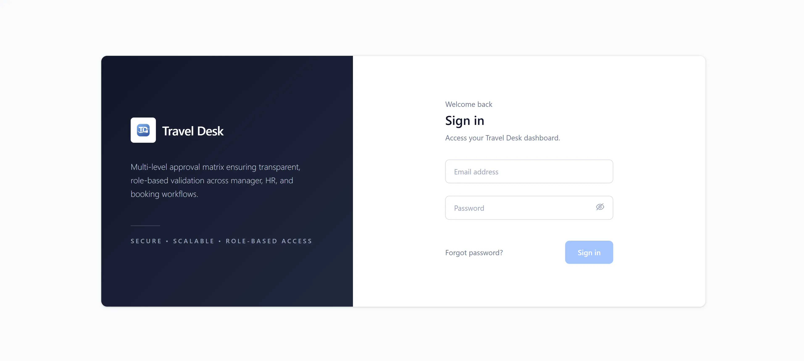
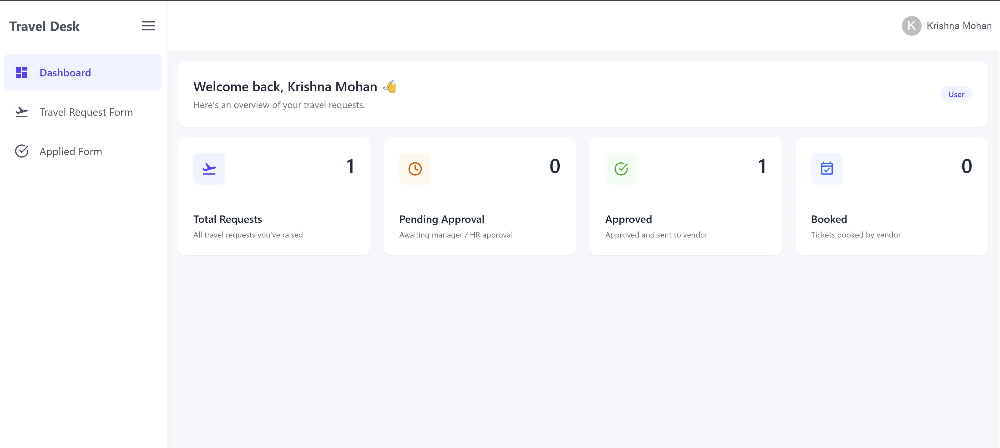
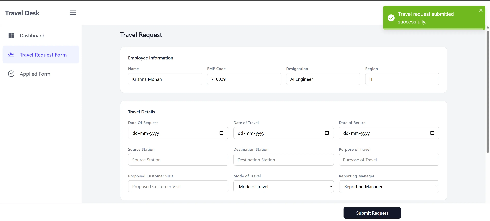
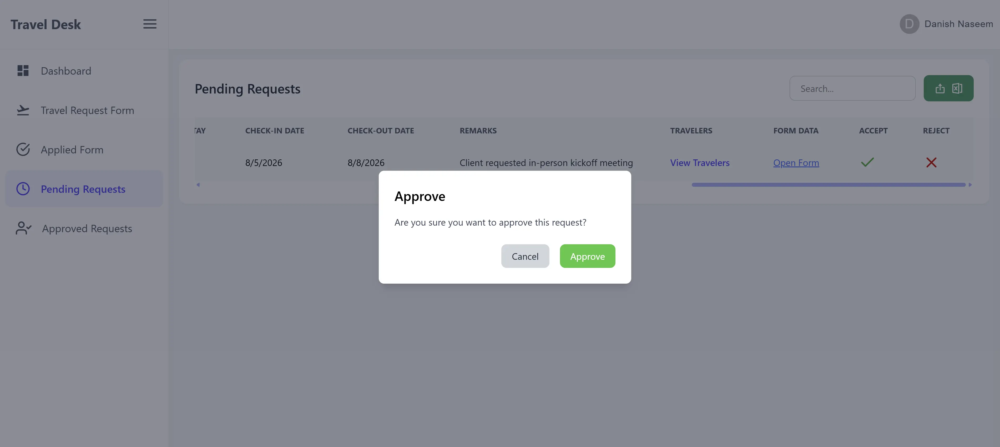
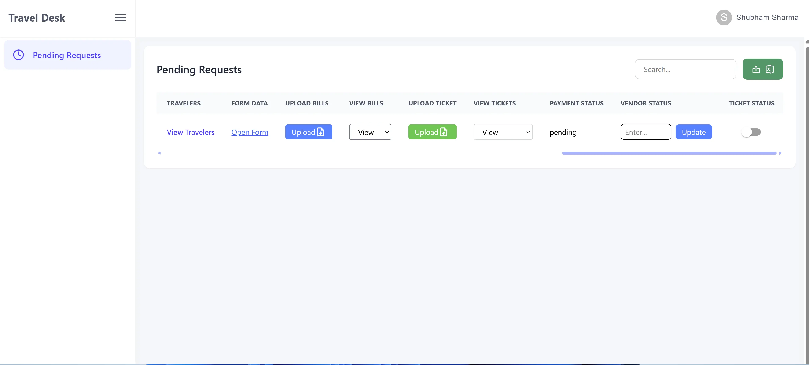
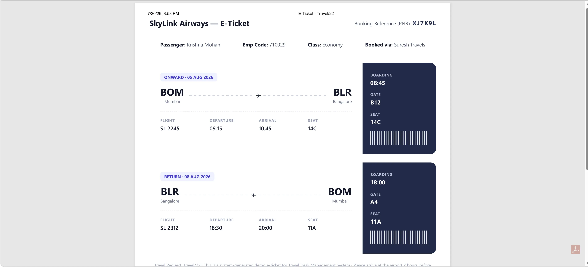
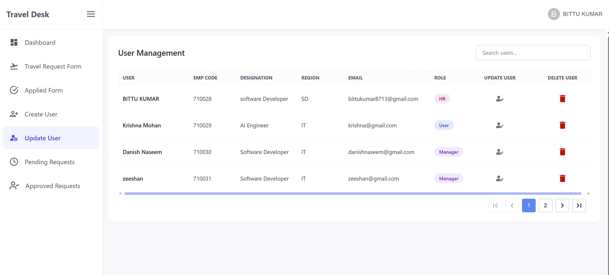
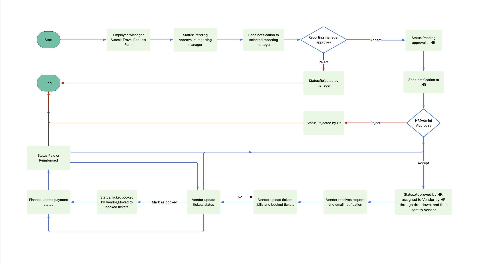
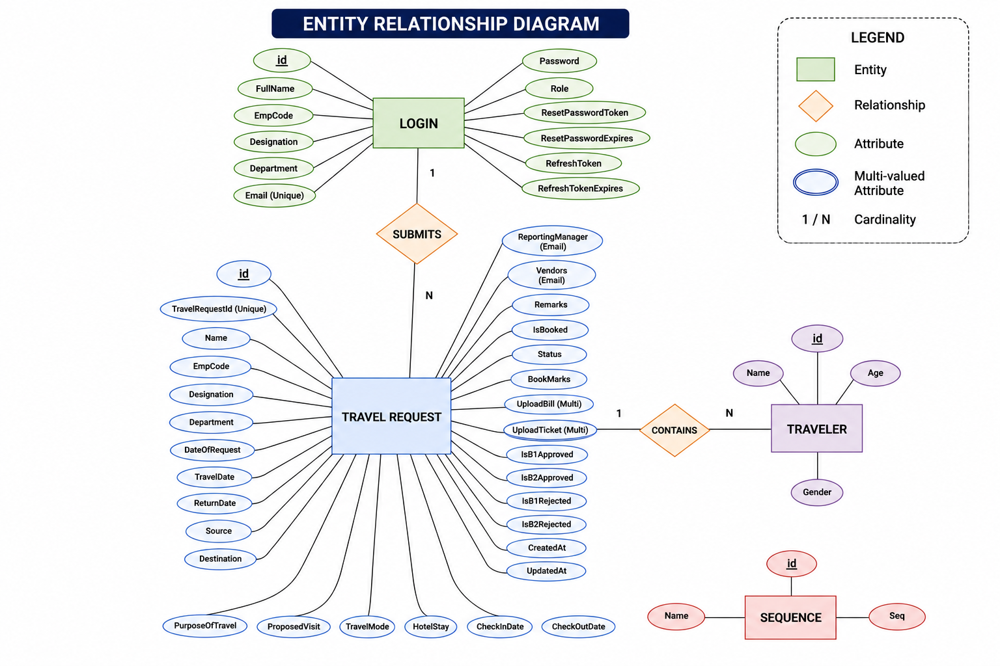
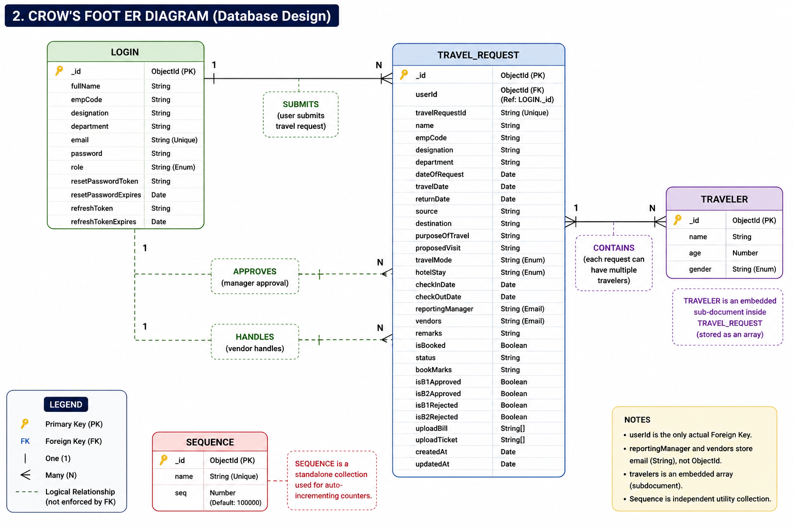

# Travel Desk Management System

A role-based platform for managing corporate travel requests end to end — from
submission, through manager and HR approval, to vendor booking and finance
payment tracking.

## Contents

- [Dashboard preview](#dashboard-preview)
- [Features](#features)
- [Roles](#roles)
- [How a Request Flows](#how-a-request-flows)
- [Flow diagram](#flow-diagram)
- [ER diagram](#er-diagram)
- [Schema diagram](#schema-diagram)
- [Tech stack](#tech-stack)
- [Project structure](#project-structure)
- [Getting started](#getting-started)
- [Available scripts](#available-scripts)
- [Known limitations](#known-limitations)

## Dashboard preview

| Login | Main Dashboard | Travel Request Form |
|-------|-----------------|----------------------|
|  |  |  |

| Pending Requests (Manager/HR) | Vendor Management | E-Ticket Upload |
|--------------------------------|--------------------|-------------------|
|  |  |  |

| User Management (HR) | Finance | Admin |
|------------------------|---------|-------|
|  | _screenshot coming soon_ | _screenshot coming soon_ |

## Features

- **Employee Requests** — submit a travel request (with multiple travelers on
  one trip if needed) and track its live status from a personal "Applied
  Form" list.
- **Two-Step Approval** — every request goes to the reporting manager first,
  then to HR. Each step sends an automatic email to the next approver
  (manager → HR → vendor). A reject at either step ends the request there.
- **Vendor Booking** — once HR approves and assigns a vendor, the vendor sees
  the request, uploads the ticket and bill, and marks the request as booked
  once travel is confirmed.
- **Finance Tracking** — finance sees every HR-approved request and updates
  its payment status.
- **Admin Overview** — a read-only view (in the UI) of every pending and
  approved request across the company, for full management visibility.
- **Search, Filter & Export** — search and page through long lists of
  requests, and export pending requests to Excel with one click.
- **User Management** — HR can create, update, and remove accounts for
  employees, managers, vendors, and finance staff.
- **Secure Login & Password Reset** — JWT session in an httpOnly cookie,
  bcrypt-hashed passwords, and an email-based forgot/reset-password flow.
  New accounts can be created either by signing up directly or by HR adding
  a user from the dashboard.

## Roles

| Role     | Can do |
|----------|--------|
| Employee | Submit and track their own requests |
| Manager  | First approval on a request |
| HR       | Second approval, assigns a vendor, manages user accounts |
| Vendor   | Uploads tickets/bills, records a booking reference, marks a request as booked |
| Finance  | Updates payment status |
| Admin    | Views every request across the company (read-only in the UI) |

## How a Request Flows

### User Management

HR creates and manages user accounts for Employees, Managers, Vendors, and Finance users.

### Start

An Employee or Manager logs into the system, fills out the travel request form, and submits it.

### Travel Request Submitted

The request status changes to **Pending Approval at Reporting Manager**, and the Reporting Manager receives an email notification.

### Reporting Manager Decision

The Reporting Manager reviews the request.

- **Approve:** The status changes to **Pending Approval at HR**, and HR receives an email notification.
- **Reject:** The status changes to **Rejected by Manager**, and the workflow ends.

### HR Decision

- **Approve:** HR assigns a travel vendor from the vendor list. The status changes to **Approved by HR – Assigned to Vendor**, and the selected vendor receives an email notification.
- **Reject:** The status changes to **Rejected by HR**, and the workflow ends.

### Vendor Receives the Request

After receiving the notification, the assigned vendor can view the request in their dashboard.

### Vendor Uploads Documents

The vendor books the travel arrangements and uploads all required documents, such as tickets.

### Vendor Updates Booking Status

The vendor continues uploading the required documents until the travel is confirmed, then marks the request as **Booked**. The request is moved to the **Booked Tickets** view.

### Finance Updates Payment

After the booking is completed, the Finance team updates the payment status by marking it as **Paid** or **Reimbursed**.

### End

Once the payment has been processed, the travel request lifecycle is complete.

> **Note:** The Admin can view every request at any stage of the workflow across all employees and vendors. The Admin is not part of the approval process and has read-only access.

## Flow diagram



## ER diagram



## Schema diagram



## Tech stack

**Client** — React 19, Vite, Tailwind CSS, MUI, Redux Toolkit, React Router,
Axios, react-icons, xlsx (Excel export).

**Server** — Node.js, Express, MongoDB (Mongoose), JWT auth (httpOnly
cookies), bcrypt, Multer (file uploads), Nodemailer (email notifications).

## Project structure

```
travel-desk-management-system/
├── client/            React frontend (Vite)
│   └── src/
│       ├── pages/     Route-level pages (dashboards, forms, landing page)
│       └── components/
└── server/            Express backend
    └── src/
        ├── models/       Mongoose schemas (User, TravelRequest)
        ├── controllers/  Route handlers
        ├── services/     Business logic
        ├── routes/       API route definitions
        ├── middleware/   Auth & role guards, file upload
        └── utils/        Email templates & helpers
```

## Getting started

### Prerequisites

- Node.js
- A MongoDB instance (local or Atlas)
- An SMTP account for outgoing email (e.g. Mailtrap for development)

### Server setup

```bash
cd server
npm install
```

Create a `.env` file in `server/` with:

```
PORT=5000
VITE_FRONTEND_KEY=http://localhost:5173

MONGODB_URI=your_mongodb_connection_string

JWT_SECRET=your_jwt_secret
JWT_REFRESH_SECRET=your_refresh_secret

EMAIL_HOST=your_smtp_host
EMAIL_PORT=587
EMAIL_USER=your_smtp_user
EMAIL_PASS=your_smtp_password
```

```bash
npm run dev
```

### Client setup

```bash
cd client
npm install
```

Create a `.env` file in `client/` with:

```
VITE_API_KEY=http://localhost:5000
```

```bash
npm run dev
```

The client runs on `http://localhost:5173` and talks to the server on
`http://localhost:5000`.

### Creating your first account

There's no seed data — go to `/signup`, fill in your details, and pick a
role (Employee, Manager, HR, Vendor, or Finance). Pick **HR** first if you
want to add the rest of your team afterward from the HR dashboard, since
that's the only role with a "Create User" screen. (The `admin` role isn't
offered on the sign-up form; it has to be set directly on the user document
in the database.)

## Available scripts

**Server** (run from `server/`)

| Command | Description |
|---------|-------------|
| `npm start` | Run the server once with plain Node |
| `npm run dev` | Run the server with nodemon (auto-restarts on changes) |

**Client** (run from `client/`)

| Command | Description |
|---------|-------------|
| `npm run dev` | Start the Vite dev server |
| `npm run build` | Build a production bundle |
| `npm run preview` | Preview the production build locally |
| `npm run lint` | Run ESLint |

## Known limitations

- `POST /register` and the `/signup` page are open to anyone and let the
  caller pick their own role — there's no invite-only gate yet.
- `GET /managers` and `GET /vendors` are unauthenticated.
- File uploads (tickets/bills) have no size or file-type restriction.
- Requests are fetched in full on the backend; search and pagination are
  handled client-side only.

## Notes

- Uploaded ticket and bill files are stored on the server under
  `server/src/upload/`.
